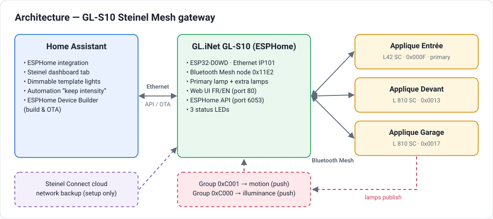
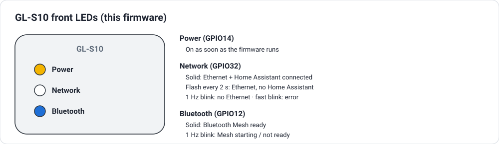
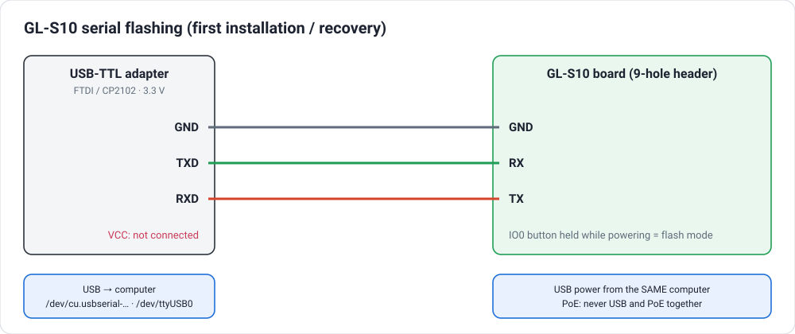
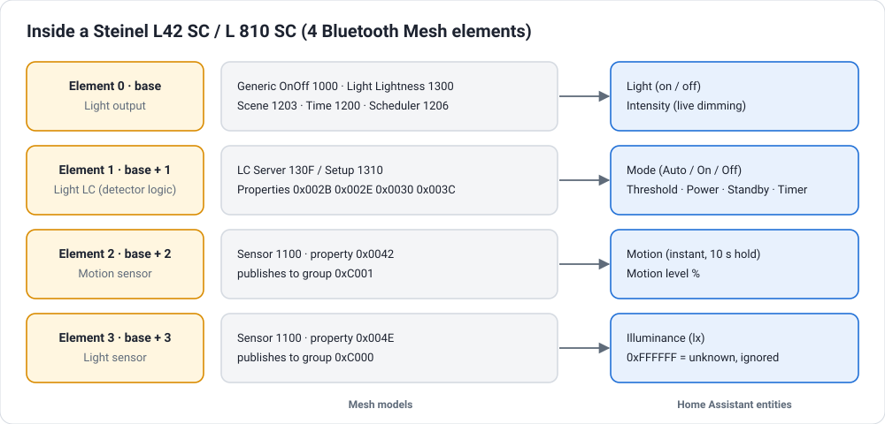
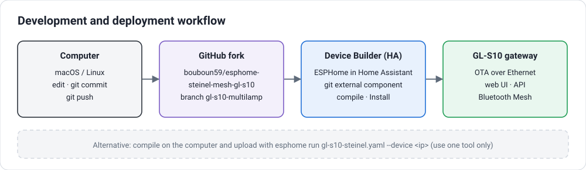

# Steinel Bluetooth Mesh Gateway — GL-S10 (Ethernet) multi-lamp fork

🇫🇷 [Version française](README_FR.md) · 📜 [Original project README](README_UPSTREAM.md)

This repository is a **fork of [supczinskib/steinel-nightmatiq-esp32-c3-gateway](https://github.com/supczinskib/steinel-nightmatiq-esp32-c3-gateway)**,
an excellent ESPHome gateway that controls a Steinel **NightmatIQ Plus** over Bluetooth Mesh from an **ESP32-C3**.

This fork adapts the project to a different use case:

- runs on a **GL.iNet GL-S10** (classic ESP32, **wired Ethernet**, no Wi-Fi needed),
- drives **several Steinel Connect luminaires at once** from a single gateway
  (tested with one **L42 SC** and two **L 810 SC**),
- exposes, for **each** luminaire, the same set of entities in Home Assistant
  (mode, light state, **live dimming**, motion, illuminance, detector settings, firmware…),
- pushes changes to Home Assistant **as soon as they happen**, instead of periodic spam,
- ships a ready-to-use **Home Assistant layer**: dimmable light entities, a dashboard tab
  and an automation that keeps your chosen brightness.



> ⚠️ Community project, **not affiliated with, endorsed or supported by STEINEL**.
> It was developed and tested on one installation (1× L42 SC, 2× L 810 SC). Other Steinel
> Connect products may behave differently. Use at your own risk and keep a way to re-flash
> your gateway (see *Recovery*).

---

## Table of contents

1. [What changed compared to the original project](#1-what-changed-compared-to-the-original-project)
2. [Hardware](#2-hardware)
3. [How Steinel luminaires are organised in the mesh](#3-how-steinel-luminaires-are-organised-in-the-mesh)
4. [Architecture of the multi-lamp gateway](#4-architecture-of-the-multi-lamp-gateway)
5. [Entities exposed per luminaire](#5-entities-exposed-per-luminaire)
6. [Web interface of the gateway](#6-web-interface-of-the-gateway)
7. [Build and installation from a computer (macOS / Linux)](#7-build-and-installation-from-a-computer-macos--linux)
8. [ESPHome Device Builder (Home Assistant)](#8-esphome-device-builder-home-assistant)
9. [Configuring your own luminaires](#9-configuring-your-own-luminaires)
10. [Home Assistant layer](#10-home-assistant-layer)
11. [Lessons learned and troubleshooting](#11-lessons-learned-and-troubleshooting)
12. [Known limitations and roadmap](#12-known-limitations-and-roadmap)
13. [Security](#13-security)
14. [License and credits](#14-license-and-credits)

---

## 1. What changed compared to the original project

| Area | Original project | This fork |
|---|---|---|
| Hardware | ESP32-C3 Super Mini, Wi-Fi | **GL.iNet GL-S10** (ESP32-D0WD, IP101 Ethernet PHY), Ethernet only |
| Luminaires | one NightmatIQ Plus (3 elements) | **one primary + up to 4 extra luminaires**, 4 elements each (L42 SC, L 810 SC) |
| Node table | 1 node, 3 elements | up to 4 nodes, **4 elements** per node |
| Motion | not exposed | **Motion** (binary, instant via group publications) + **Motion level** (%) |
| Illuminance | element +2, polled | element +3, **pushed by the lamps** (group `0xC000`) + polled as fallback |
| Detector settings | twilight threshold (primary only) | threshold, **power (lightness on)**, **standby light**, **hold time** for every lamp |
| Live dimming | — | **Intensity** (Light Lightness client) for every lamp |
| Identity | NightmatIQ only | firmware / hardware revision of **every lamp**, read from BLE advertisements |
| HA traffic | values re-sent every few seconds | values sent **only when they change**, checked every second |
| Diagnostics | — | optional **Steinel vendor-message sniffer** (group `0xFEFF`) |
| Web interface | NightmatIQ page (one lamp), update from GitHub | **multi-lamp dashboard + advanced page, FR/EN**, firmware upload; GitHub update (ESP32-C3) disabled |
| Build | command line | **macOS / Linux** command line or **ESPHome Device Builder** in Home Assistant |
| LEDs | status LED only (off when healthy) | **3 meaningful LEDs**: power, network/Home Assistant, Bluetooth Mesh |
| Home Assistant | device entities | + **template lights with brightness slider**, **dashboard tab**, **brightness-keeping automation** |

Everything specific to the upstream NightmatIQ behaviour (web UI, Steinel cloud import,
Auto/On/Off modes of the primary lamp, OTA, safe mode…) is kept.

---

## 2. Hardware

### GL.iNet GL-S10

| Item | Value measured on the tested unit |
|---|---|
| Module | ESP32-WROOM-32U (external antenna, IPEX connector) |
| Chip | ESP32-D0WD **rev 1.1**, 40 MHz crystal |
| Flash | 4 MB (manufacturer ID `0x46`) |
| Ethernet PHY | **IP101** (hardware revision 2.x) — MDC GPIO23, MDIO GPIO18, CLK GPIO0 input, PHY addr 1, power GPIO5 |
| LEDs | power GPIO14, Bluetooth GPIO12, network GPIO32 (all inverted) |
| Button | GPIO33 (side button) |

### Front LEDs



| LED | GPIO | Behaviour |
|---|---|---|
| Power | 14 | on as soon as the firmware runs |
| Network (WAN) | 32 | **solid** = Ethernet + Home Assistant connected · **flash every 2 s** = Ethernet but no Home Assistant · **1 Hz blink** = no Ethernet · **fast blink** = component error |
| Bluetooth | 12 | **solid** = Mesh ready · **1 Hz blink** = Mesh starting / not ready |

The network LED replaces ESPHome's `status_led`, which stays off when everything is fine.

The GL-S10 radio is dedicated to Bluetooth Mesh: **it cannot be a Bluetooth proxy at the
same time**. Use another ESP32 for the ESPHome Bluetooth proxy.

> Hardware revision 1.0 uses a LAN8720 PHY instead of IP101 (clock on GPIO17, no power pin).
> Newer IP101 revisions are reported to suffer from packet loss on some networks.

### Serial adapter (first flash / recovery)



- **3.3 V USB-TTL adapter** with a genuine **FTDI FT232RL** or **Silicon Labs CP2102** chip.
  Counterfeit **PL2303** adapters do not work on recent macOS.
- Open the case (notch at the bottom), unplug the IPEX antenna, take the board out.
- Wire **TXD → RX**, **RXD → TX**, **GND → GND** on the labelled 9-hole header. Do **not** connect VCC.
- Flash mode: hold the button next to the 9 holes (or tie **IO0** to GND) while powering the GL-S10.
- Power the GL-S10 **from the same computer** as the adapter: with a separate charger, the adapter
  may disconnect when the GL-S10 powers up (ground offset), and nothing will be read.
- If the GL-S10 is powered over PoE, **never** connect USB and PoE at the same time.

---

## 3. How Steinel luminaires are organised in the mesh

Everything below was read from the Steinel cloud backup (`/project/network/<id>/backup`, standard
*Mesh Configuration Database* JSON) and confirmed with live traffic.

### Composition of an L42 SC / L 810 SC (4 elements)



| Element | Address | Main models | Role |
|---|---|---|---|
| 0 | base | Generic OnOff `1000`, Level `1002`, Power OnOff `1006`, **Light Lightness `1300`**, Time `1200`, Scheduler `1206`, **Scene `1203`** | light output |
| 1 | base + 1 | **Light LC Server `130F`** / Setup `1310`, vendor `0563:1001/1004/1005/1006` | automatic light controller (detector logic) |
| 2 | base + 2 | Sensor `1100` — property **`0x0042` Motion Sensed** | motion |
| 3 | base + 3 | Sensor `1100` — property **`0x004E` Present Ambient Light Level** | illuminance |

### What the lamps publish (without any gateway change)

| Publication | Destination | Period |
|---|---|---|
| Motion (element 2) | group **`0xC001`** (shared by all lamps) | ~4 s + on change |
| Illuminance (element 3) | group **`0xC000`** | ~10 s |
| Time (`1200`) | `0xFFFF` | — |
| Vendor model `0563:1005` (element 1) | group **`0xFEFF`** | not observed on state changes (see §12) |
| **Light on/off, lightness, LC state** | **nothing** | → must be polled |

### Useful facts

- The **Auto** mode of the Steinel app = *LC mode enabled* + **recall of scene 3** ("Nightmatic").
  A Bluetooth Mesh scene also stores the **LC properties**: recalling it **resets the detector
  brightness** to the value saved by the Steinel app (93 % here). See §10.3.
- Detector settings are standard **Light LC properties** on element 1:
  `0x002B` ambient lux level on (threshold), `0x002E` lightness on ("power"),
  `0x0030` lightness standby ("standby light"), `0x003C` time run on ("hold time").
- The last two bytes of the Steinel manufacturer data in BLE advertisements
  (company `0x0563`) match the 4-hex-digit suffix of the lamp name (`L 810 SC A52C` → `0xA52C`).
  The advertisement also carries product ID, firmware (major.minor.patch), bootloader and hardware revision.
- Illuminance `0xFFFFFF` means **"unknown"** (167 772.15 lx if decoded naively).

---

## 4. Architecture of the multi-lamp gateway

### Primary lamp vs extra lamps

- The **primary lamp** is the one selected in the web UI during the Steinel import (node address).
  It keeps the complete upstream logic (confirmed Auto/On/Off transactions, threshold, identity…).
- **Extra lamps** are declared in YAML (`on_boot`) with their base address and scene number.
  They get a lighter, independent implementation:
  - commands (mode, threshold, detector settings, intensity) are sent **unacknowledged, twice**,
    then **read back** for confirmation;
  - state is **polled** in an interleaved round-robin (on/off, LC mode, illuminance, threshold);
  - motion and illuminance **publications** are routed by source address.

### Mesh stack changes (ESP-BLE-MESH, provisioner role)

| Problem found | Fix |
|---|---|
| `Failed to find Dst 0x….` — a provisioner only sends to addresses present in its node table | all lamps are **restored in the node table** with **4 elements**; `CONFIG_BLE_MESH_MAX_PROV_NODES: "4"` |
| `RPLFull` — replay protection list sized for 3 sources | `CONFIG_BLE_MESH_CRPL: "16"` |
| lamps publish motion/illuminance to groups | local subscription of the sensor client to `0xC001` and `0xC000` (`CONFIG_BLE_MESH_MODEL_GROUP_COUNT: "2"`) |
| live dimming | new **Light Lightness client** model (`CONFIG_BLE_MESH_LIGHT_LIGHTNESS_CLI: y`), bound to the AppKey |
| vendor sniffer | vendor model `0563:1FFF` accepting the **64 possible Steinel vendor opcodes**, subscribed to `0xFEFF` |

### Firmware changes (component `nightmatiq_mesh`)

- Wi-Fi code guarded by `#ifdef USE_WIFI` (the GL-S10 build has no Wi-Fi component).
- Node restored with 4 elements; illuminance read on element +3; motion on element +2.
- Extra-lamp layer: `add_lamp()`, `set_lamp_mode()`, `lamp_*()` getters, response routing in the
  generic / light / sensor callbacks (before the primary-lamp counters).
- LC properties layer: `add_lc_props()`, `set_lamp_lc_prop()`, `lamp_lc_prop()` for `0x002E`, `0x0030`, `0x003C`
  (threshold `0x002B` handled separately), with per-lamp buffers (ESP-IDF does not copy property values).
- Intensity: `set_lamp_lightness()` / `lamp_lightness()` (Light Lightness Set Unack / Get).
- Identity: `set_primary_tag()` / `set_lamp_tag()` match BLE advertisements to lamps;
  the identity scan waits until every lamp has been seen (30 s max).
- `0xFFFFFF` illuminance ignored; primary Mode and Threshold published only when they change.
- Motion: `poll_motion()` (fallback, every 6th call) and primary on/off polling.
- Faster interleaved polling of extra lamps (one lamp then the other, every 1.5 s).
- Web interface: embedded *Dashboard* and *Advanced* pages (`steinel_dashboard.h`, `steinel_advanced.h`), JSON route `/steinel/lamps`, `set_primary_name()` / `set_lamp_name()`, GitHub update disabled.
- Steinel vendor-message listener (vendor model `0563:1FFF`, 64 opcodes, group `0xFEFF`).

### YAML changes (`esphome/gl-s10-steinel.yaml`)

- Built **on top of the working GL-S10 Bluetooth-proxy configuration** (board, Ethernet, LEDs),
  with `esp32_ble_tracker` / `bluetooth_proxy` removed.
- `on_boot` lambda declaring groups, extra lamps, identity tags and LC properties.
- Template entities for every lamp, published **only on change** (`static last` pattern, `update_interval: 1s`).
- Motion `delayed_off` filter (10 s by default) — lamps report *instantaneous* motion.
- Signal strength filtered (`delta: 3` dB).
- `ota: - platform: web_server` to upload firmware from the web page.
- LED logic (250 ms interval): network LED from Ethernet / Home Assistant / error state, Bluetooth LED from *Mesh Ready*.

---

## 5. Entities exposed per luminaire

| Entity | Type | Source | Update |
|---|---|---|---|
| Mode (Auto / Always On / Always Off) | select | LC mode + on/off | on change |
| Light | binary sensor | Generic OnOff | polled (3–6 s) / instant for HA commands |
| **Intensity** | number 0–100 % | Light Lightness | instant on command, read back |
| Motion | binary sensor (motion) | `0x0042`, group `0xC001` | **instant** (+ 10 s hold) |
| Motion level | sensor % (diagnostic) | `0x0042` | instant |
| Illuminance | sensor lx | `0x004E`, group `0xC000` | ~10 s (lamp period) |
| Threshold | number lx | LC `0x002B` | on change |
| Power | number % | LC `0x002E` | on change |
| Standby light | number % | LC `0x0030` | on change |
| Hold time | number s | LC `0x003C` | on change |
| Signal | sensor dBm (diagnostic) | RSSI of the lamp's messages | on change ≥ 3 dB |
| Firmware, Hardware revision | diagnostic | BLE advertisements | once after boot |
| Manufacturer, Company ID, Product ID | diagnostic | backup / constants | once |

Gateway entities: *Mesh Ready*, *Status*, *Refresh*, *Safe Mode Boot*, *Reset Button*.

---

## 6. Web interface of the gateway

Open `http://<gateway-ip>` (login `admin` + your admin password). Both pages are **bilingual French / English**
(automatic from the browser language, **FR | EN** button, choice remembered) and share the same navigation tabs.

| Page | URL | Content |
|---|---|---|
| **Dashboard** | `/` | Mesh network summary, one card per lamp (mode, light, intensity, motion, illuminance, threshold, signal, firmware), **firmware upload** (`firmware.ota.bin`, progress bar, waits for the restart). Refreshed every 2 s. |
| **Advanced** | `/steinel/avance` | Gateway (Mesh state, runtime mode, firmware, uptime, reset reason, memory, admin password state), Mesh counters, **table of all lamps** (role, address range, firmware, signal), Steinel network (import / suspend / resume / remove), admin password, refresh, factory reset. |
| Original page | `/steinel/classique` | The upstream NightmatIQ page, kept as a fallback. |
| JSON | `/steinel/lamps`, `/steinel/status` | Machine-readable state. |

- Firmware upload uses ESPHome's `ota: - platform: web_server` (`/update`), protected by the admin login.
- The upstream **automatic update from GitHub is disabled**: it downloads the ESP32-C3 firmware, which is not
  compatible with the GL-S10.

---

## 7. Build and installation from a computer (macOS / Linux)

### 7.1 Requirements

The component requires **ESPHome ≥ 2026.7.3** (tested with 2026.7.3).

**macOS** (Homebrew):
```bash
brew install python@3.13 git
python3.13 -m venv ~/esphome-steinel
source ~/esphome-steinel/bin/activate
pip install --upgrade pip wheel
pip install "esphome==2026.7.3"
```
On an **Intel Mac**, `cbor2` may need to be built: `brew install rust`, then run `pip install` again.

**Linux** (Debian / Ubuntu / Raspberry Pi OS):
```bash
sudo apt update && sudo apt install -y python3-venv python3-pip git
python3 -m venv ~/esphome-steinel
source ~/esphome-steinel/bin/activate
pip install --upgrade pip wheel
pip install "esphome==2026.7.3"
sudo usermod -aG dialout "$USER"   # serial port access (log out / in afterwards)
```

Get the code:
```bash
git clone -b gl-s10-multilamp https://github.com/bouboun59/esphome-steinel-mesh-gl-s10.git
cd esphome-steinel-mesh-gl-s10/esphome
```

### 7.2 Secrets

Create `esphome/secrets.yaml` (**never commit it**, it is ignored by `.gitignore`):
```yaml
ota_password: "the admin password of the gateway web page"
api_encryption_key: "…"   # optional, see §13
```
> The component **aligns the OTA password with the web admin password**: after changing the admin password in
> the web UI, OTA uploads require that same password in `secrets.yaml`.

### 7.3 Build

```bash
source ~/esphome-steinel/bin/activate
esphome compile gl-s10-steinel.yaml
```
The first build downloads ESP-IDF and takes 10–30 minutes.

### 7.4 First flash (serial)

Serial port name: macOS `/dev/cu.usbserial-XXXX` or `/dev/cu.wchusbserial-XXXX` (`ls /dev/cu.*`),
Linux `/dev/ttyUSB0` (`ls /dev/ttyUSB*`). Put the GL-S10 in flash mode (button next to the 9-hole header held
while powering it), then:

```bash
esptool --port <PORT> --baud 115200 --before no-reset --after no-reset --chip esp32 \
        write-flash -z 0x0 .esphome/build/gl-s10-steinel/build/firmware.factory.bin
```
Unplug / replug the power **without** the button. The gateway gets an address by DHCP (or the fixed one, §7.7).

### 7.5 Updates over the network

```bash
esphome run gl-s10-steinel.yaml --device <gateway-ip>
```
or upload `.esphome/build/gl-s10-steinel/build/firmware.ota.bin` from the **Dashboard** web page.

### 7.6 Initial setup (web UI)

1. Open `http://<gateway-ip>`, log in with `admin` / `12345678`, then **Advanced → Security**: change the admin
   password (and copy it to `ota_password`).
2. **Advanced → Steinel network**: enter your Steinel Connect account, find your networks, choose yours.
3. **Primary lamp address**: e.g. `000F` (empty = first compatible node). IV Index `0` → **Install**.
4. Add the device in Home Assistant (ESPHome integration).

### 7.7 Fixed IP address (optional)

Add `manual_ip` to the `ethernet:` block. For the upload that changes the address, keep
`use_address: <current address>`, then remove it:
```yaml
ethernet:
  # … existing settings (id, type, pins) …
  manual_ip:
    static_ip: 192.168.1.238
    gateway: 192.168.1.1
    subnet: 255.255.255.0
    dns1: 192.168.1.2
    dns2: 192.168.1.1
  use_address: 192.168.1.58   # only for this upload
```
Alternative without firmware change: a DHCP reservation on your router for the gateway MAC address.

### 7.8 macOS / zsh tips

- Pasting commands with `# comments` may fail in zsh: `echo 'setopt interactivecomments' >> ~/.zshrc`.
- In a *heredoc* (`<<'EOF'`), the closing `EOF` must be at the very beginning of the line.
- Passwords with special characters: `read -rs 'PW?Password: '` then use `"$PW"`.

---

## 8. ESPHome Device Builder (Home Assistant)



You can build and install the gateway **directly from Home Assistant** (tested: Device Builder 2026.9.0).
The component is downloaded from GitHub at every build, so the only file in Home Assistant is the YAML.

1. **Device Builder → Secrets**: add
   ```yaml
   ota_password: "<gateway admin password>"
   api_encryption_key: "<base64 key, e.g. the one generated by Device Builder>"
   ```
2. **+ New device** (skip the wizard) named `gl-s10-steinel`, **Edit**, replace **everything** with
   [`esphome/device-builder/gl-s10-steinel.yaml`](esphome/device-builder/gl-s10-steinel.yaml). Its
   `external_components` block points to this repository:
   ```yaml
   external_components:
     - source:
         type: git
         url: https://github.com/bouboun59/esphome-steinel-mesh-gl-s10
         ref: gl-s10-multilamp
         path: esphome/components
       components: [nightmatiq_mesh]
       refresh: 0s
   ```
3. Adapt the `on_boot` lambda (your lamps) and, if needed, the fixed IP (§7.7).
4. If Device Builder asks for the board, choose **DOIT ESP32 DEVKIT V1** (`esp32doit-devkit-v1`).
5. **Install → Wirelessly** (the first build on the Home Assistant host takes 10–30 minutes and needs ~2 GB RAM).
6. With API encryption enabled, Home Assistant asks for the key once
   (*Settings → Devices & services → ESPHome → Reconfigure*).

> ⚠️ Never install the default template created by the Device Builder wizard on the GL-S10 (`esp32dev`, Wi-Fi
> only): the gateway would lose Ethernet and Mesh, and would have to be re-flashed over serial.

**Workflow**: change the code on a computer → `git commit` / `git push` → **Install** in Device Builder.
Use one tool to flash (Device Builder **or** the command line) to avoid mixing versions.
When the repository YAML changes, apply the same change to the Device Builder YAML.

---

## 9. Configuring your own luminaires

All the information comes from your Steinel backup. Download it (same endpoints as the web UI):

```bash
read -rs 'PW?Steinel password: '; echo
H=(-u "you@example.com:$PW" -H 'X-Accept-Version: 2.4' -H 'User-Agent: A4.1-62' -H 'Device: PC-1')
curl -s "${H[@]}" 'https://connectapp.steinel.de/api/changes?since=4102444800&force_full_personal_sync=true&force_full_translation_sync=false' \
  | jq '.networks.changed[] | {id,name,nodes}'
curl -s "${H[@]}" 'https://connectapp.steinel.de/api/project/network/<NETWORK-ID>/backup' > steinel-backup.json
```
> `steinel-backup.json` contains the **network keys and device keys**: keep it private, never commit it.

Useful queries:

```bash
# nodes, addresses and models (no keys)
jq '.nodes[] | {name, unicastAddress, pid, models: [.elements[] | [.models[].modelId]]}' steinel-backup.json
# default scene of each lamp (Auto mode)
jq '.. | objects | select(has("nodeAddress") and has("defaultSceneNumber"))' steinel-backup.json
# what each sensor publishes
jq '.nodes[] | {name, pubs: [.elements[] | .models[] | select(.publish != null) | {modelId, to: .publish.address}]}' steinel-backup.json
```

Then adapt the `on_boot` lambda of `gl-s10-steinel.yaml`:

```yaml
esphome:
  on_boot:
    then:
      - lambda: |-
          id(nightmatiq_gateway).add_group(0xC001);          // motion group
          id(nightmatiq_gateway).add_group(0xC000);          // illuminance group
          id(nightmatiq_gateway).add_lamp(0x0013, 3);        // extra lamp: base address, scene
          id(nightmatiq_gateway).add_lamp(0x0017, 3);
          id(nightmatiq_gateway).set_primary_tag(0x308A);    // suffix of the primary lamp name
          id(nightmatiq_gateway).set_lamp_tag(0x0013, 0xD58E);
          id(nightmatiq_gateway).set_lamp_tag(0x0017, 0xA52C);
          id(nightmatiq_gateway).add_lc_props(0x000F);       // detector settings (all lamps)
          id(nightmatiq_gateway).add_lc_props(0x0013);
          id(nightmatiq_gateway).add_lc_props(0x0017);
```

…and duplicate the template entities of one extra lamp for each additional lamp
(replace the address). The primary lamp uses the component-bound entities.

Tested installation, for reference:

| Lamp | Model | Base address | Tag | Name in HA |
|---|---|---|---|---|
| primary | L42 SC | `0x000F` | `0x308A` | Applique Entrée |
| extra | L 810 SC | `0x0013` | `0xD58E` | Applique Devant |
| extra | L 810 SC | `0x0017` | `0xA52C` | Applique Garage |

---

## 10. Home Assistant layer

Example files are in [`home-assistant/gl-s10/`](home-assistant/gl-s10/). Entity IDs depend on the
names you give to the device and entities: adjust them.

### 10.1 Dimmable light per luminaire (template light)

The gateway exposes *Mode* and *Intensity* separately. A **template light** turns them into a
real HA light with a brightness slider ([`template-lights.yaml`](home-assistant/gl-s10/template-lights.yaml),
or create them from *Settings → Devices & services → Helpers → Template → Light*):

- **turn on** → sets the intensity to the *memorised intensity*, then *Always On*;
- **slider** → sets the intensity immediately, then *Always On*, and memorises the value;
- **turn off** (or 0 %) → back to **Auto** (the detector takes over again);
- state = *Light* binary sensor, brightness = *Intensity*.

The intensity is sent **before** switching to *Always On*: a Generic OnOff Set restores the
last lightness, so the lamp goes straight to the requested level without flashing.

### 10.2 Dashboard tab

[`dashboard-view.yaml`](home-assistant/gl-s10/dashboard-view.yaml) — a *sections* view with, for
each luminaire: the light tile with its brightness slider, motion, illuminance and the mode buttons.
Add it via *Dashboard → edit → + (new view) → ⋮ → Edit in YAML*.

### 10.3 Keeping the chosen brightness

Because **Auto recalls scene 3**, the detector brightness (*Power*) goes back to the Steinel value
each time a lamp returns to Auto. The fix:

- one `input_number` per lamp, **"memorised intensity"**, updated by the slider;
- the automation [`automation-keep-intensity.yaml`](home-assistant/gl-s10/automation-keep-intensity.yaml)
  rewrites *Power* with the memorised value **3 s after a return to Auto**, and whenever the read-back
  *Power* differs by more than 1 % (e.g. scene recalled by the lamp itself).

Result: the brightness you choose is used for manual switching **and** by the detector.

---

## 11. Lessons learned and troubleshooting

| Symptom | Cause / solution |
|---|---|
| Naive port of the C3 firmware bricks the GL-S10 (no Ethernet link, no log) | Start from the **GL-S10 ESPHome proxy YAML that boots**, then add the component. Validate each step; keep the serial cable connected; flash the proxy back if needed. |
| Serial capture empty / port disappears when the GL-S10 is powered | Power the GL-S10 from the same computer; use a reconnecting reader (pyserial loop). |
| `Failed to find Dst 0x0012` | Destination outside the provisioner node table → 4 elements per node, more nodes. |
| `RPLFull` / `Replay, Src …` then timeouts | Replay protection list too small → `CRPL: 16`. |
| Illuminance shows 167 772 lx | `0xFFFFFF` = unknown value → now ignored. |
| Motion flickers on/off | Lamps report instantaneous motion → `delayed_off` (10 s by default). |
| `Authentication invalid` during OTA | OTA password = web admin password → put it in `secrets.yaml`. |
| Brightness goes back to 93 % | Scene 3 recalled by Auto → §10.3. |
| Manual switch-on very dim | Generic OnOff restores the *last* lightness → the template light now sets the intensity first. |
| `No outbound bearer found, inbound bearer 0` | Harmless: relayed packets the gateway does not retransmit. |
| Occasional `request timed out` on L 810 | Weak signal (-85…-97 dBm) → place the GL-S10 closer or between the lamps; lamps relay each other. |

---

## 12. Known limitations and roadmap

- **Detector-driven light changes are polled** (3–6 s): the lamps do not publish their on/off state.
  Changes made from Home Assistant are shown instantly.
- **Vendor message `0xFEFF`**: the sniffer received **no** message while switching/dimming from the
  mesh. Still to test: detector events and actions from the Steinel app.
- **Plan B** (not implemented): configure each lamp to publish Generic OnOff / Light Lightness status
  to a group (needs the device keys from the backup; changes the lamp configuration).
- Extra lamps do not run the full confirmed-transaction logic of the primary lamp.
- A short window (~3 s) remains after a return to Auto where the detector may use the Steinel brightness.
- Only one GL-S10 per mesh network has been tested; one gateway handles up to 1 + 4 lamps.
- The Mode select of the primary lamp remains optimistic (upstream behaviour).

---

## 13. Security

- **Never commit** `secrets.yaml` or `steinel-backup.json` (network keys, device keys).
- The gateway stores the Steinel network keys: keep it on a trusted / IoT VLAN.
- Change the web admin password at first login; it is also the OTA password.
- Enable **API encryption** (`api: encryption: key: !secret api_encryption_key`) — disabled in the
  tested configuration for simplicity.

---

## 14. License and credits

- License: **GNU GPL v3.0**, inherited from the original project (see [`LICENSE`](LICENSE)).
  In accordance with GPL-3.0 §5, files modified in this fork are listed in this README (§4) and in the
  git history, with their modification dates.
- Original project and Steinel protocol work: **[supczinskib/steinel-nightmatiq-esp32-c3-gateway](https://github.com/supczinskib/steinel-nightmatiq-esp32-c3-gateway)** — many thanks.
- GL-S10 ESPHome configuration: [blakadder/bluetooth-proxies](https://github.com/blakadder/bluetooth-proxies) and
  [devices.esphome.io](https://devices.esphome.io/devices/gl-inet-gl-s10/).
- Built with [ESPHome](https://esphome.io) and Espressif **ESP-BLE-MESH** (ESP-IDF).
- STEINEL, NightmatIQ, L 810 SC and L42 SC are trademarks of their respective owners. This project is
  independent and uses only standard Bluetooth Mesh models plus publicly observable data.
